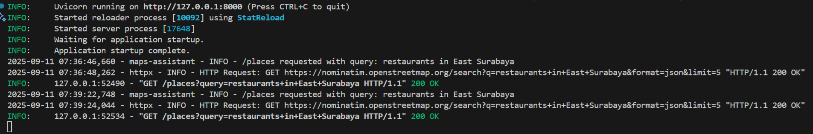
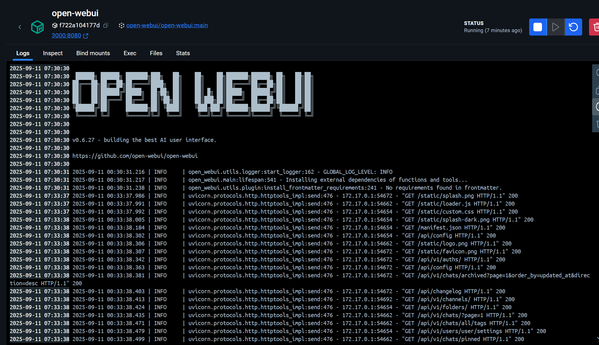
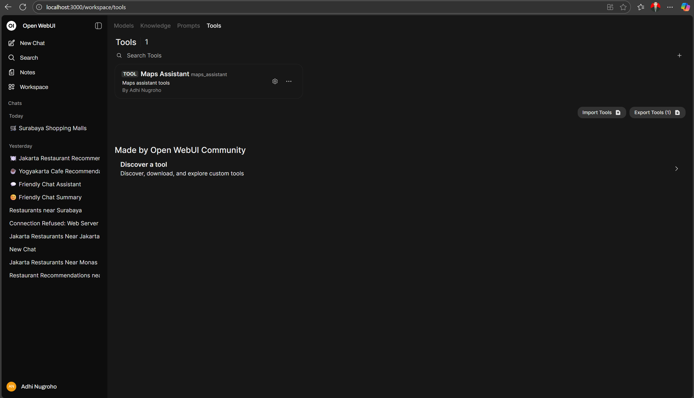
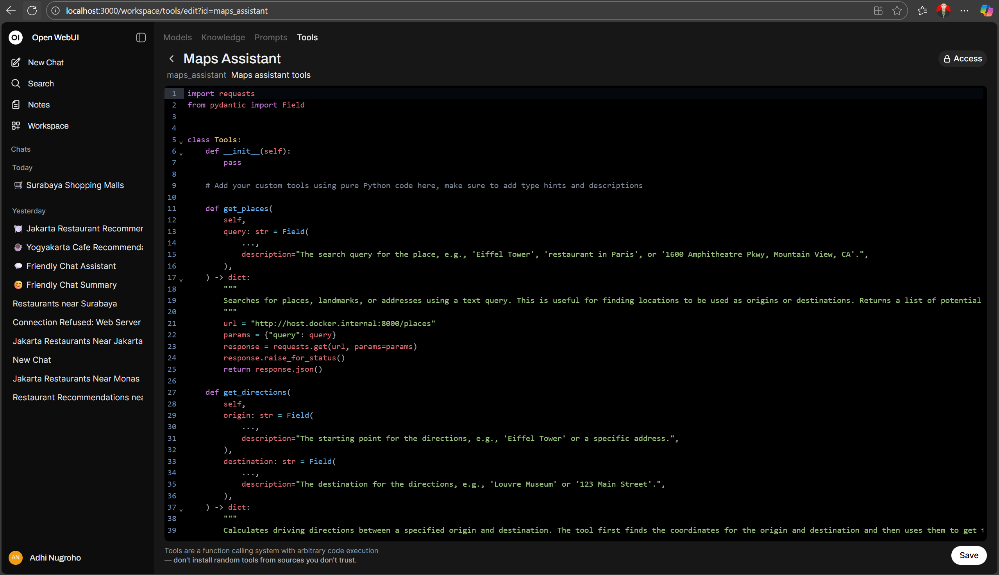
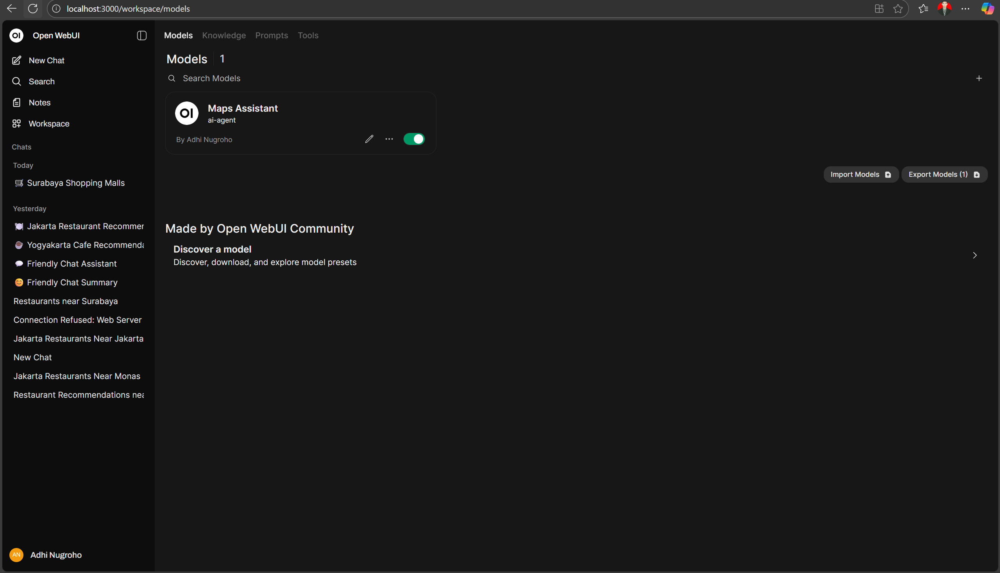
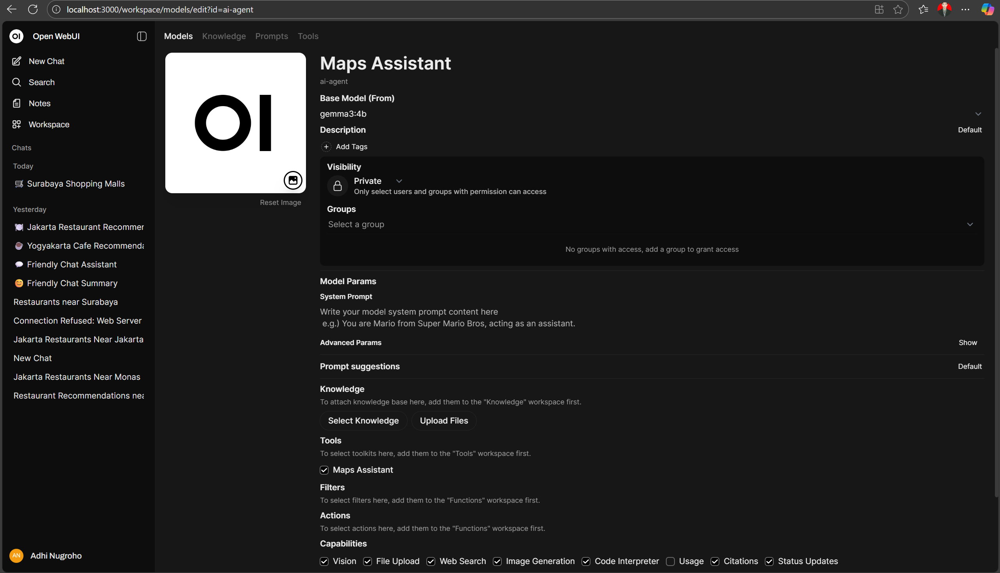
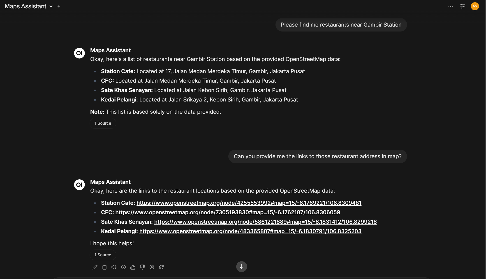
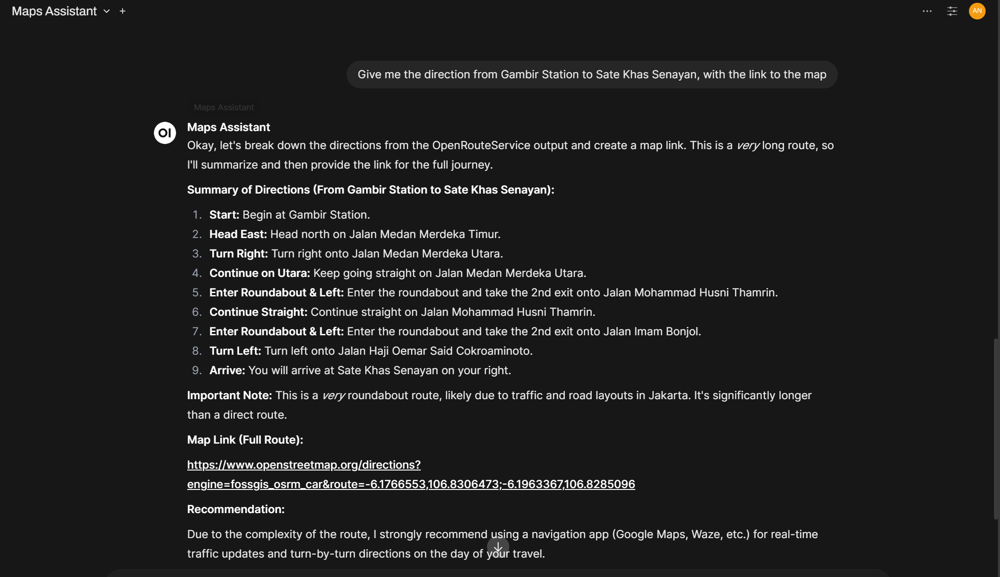

# 🗺️ My Maps Assistant

A personal maps assistant built with **FastAPI** (backend), **OpenStreetMap / OpenRouteService**, and **Open WebUI + Ollama** (frontend).

✨ Features:

* 🔍 Search for places via OpenStreetMap
* 🛣️ Get driving directions via OpenRouteService
* 🤖 Connect to Open WebUI as tools
* 💻 Runs locally — no billing required

---

## 📂 Project Structure

```
my-maps-assistant/
│── backend/      # FastAPI backend (place search + directions API)
│── frontend/     # Open WebUI (Docker run + tools + Ollama setup)
│── .gitignore
│── README.md     # This file
```

---

## 🚀 Quick Start

### 1. Backend (FastAPI)

```bash
cd backend
python -m venv .venv
source .venv/bin/activate   # or .venv\Scripts\activate on Windows

pip install -r requirements.txt
uvicorn app.main:app --reload
```

Backend runs at 👉 [http://127.0.0.1:8000](http://127.0.0.1:8000)



---

### 2. Frontend (Open WebUI)

```bash
cd frontend
./docker-run.sh
```

WebUI runs at 👉 [http://localhost:3000](http://localhost:3000)



---

### 3. Import Tools

In Open WebUI:

1. Go to **Workspace → Tools → Create -> New Tool**.



2. Paste the content of `tools.py` from this folder.



3. Now your LLM can use:

   * `get_places`
   * `get_directions`

---

### 4. Setup Ollama

Install Ollama: [https://ollama.com](https://ollama.com)

Pull lightweight models (fit under 8 GB RAM):

```bash
ollama pull gemma3:1b
ollama pull gemma3:4b
ollama pull gpt-oss:20b
```

Check installed models:

```bash
ollama list
```

Inside WebUI:
1. Go to **Workspace → Models → Create**.



2. Define the Model name. (e.g., `Maps Assistant`)
3. Select a base model.
4. In the Tools section, check one of the available tools.




Select them inside WebUI and start chatting 🚀

---

## ✅ Workflow

1. Start the **backend** (`uvicorn app.main:app --reload`).
2. Start **frontend** (`./docker-run.sh`).
3. Import tools in WebUI.
4. Create custom model (`Maps Assistant`).
5. Select the model in chat.
6. Ask for Places:

   ```
   Find me restaurants near Gambir Station
   ```

   → WebUI calls your FastAPI backend and returns results.
   
   
76. Ask for Direction:

   ```
   Give me the direction from Gambir Station to Sate Khas Senayan
   ```

   → WebUI calls your FastAPI backend and returns results.
   
   

---

## 📜 License

MIT
